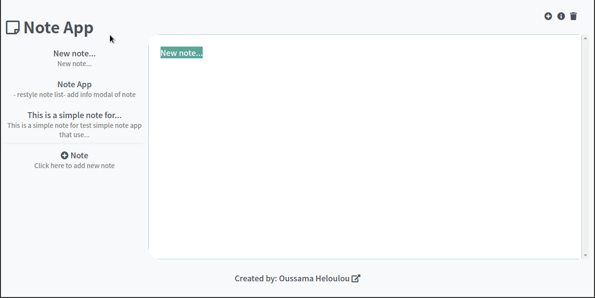

# VueJS Note App
A simple note app that uses VueJS and localStorage of browser to create and edit notes in markdown format.

## Project setup
```
npm install
```

### Compiles and hot-reloads for development
```
npm run serve
```

### Compiles and minifies for production
```
npm run build
```

### ToDos
- Add check of localStorage availability
- Create tests 
- ...

### Contributions
Contributions are welcome to improve the project.

### License
Anyone has the right to use this project in accordance with Islamic law and its values.
